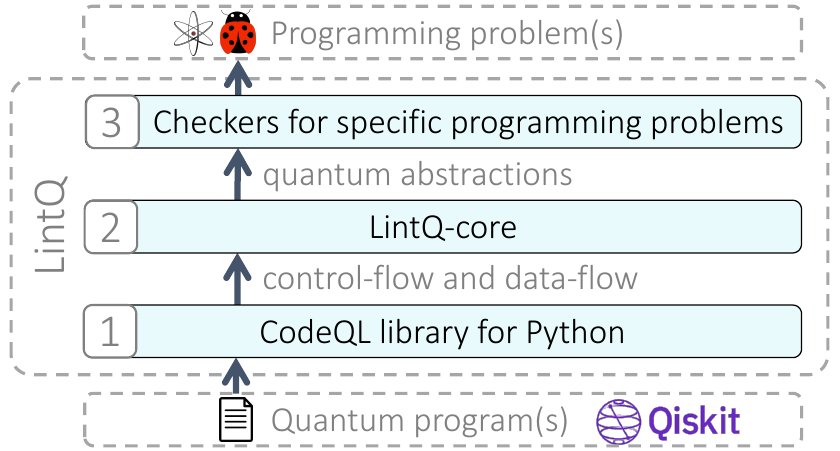
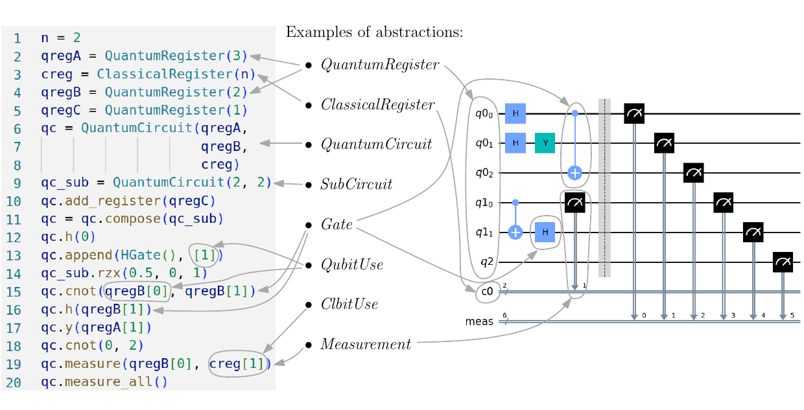

# LintQ: A Static Analysis Framework for Qiskit Quantum Programs


LintQ is a framework for static analysis of quantum programs written in Qiskit.
It comprises:
1. **LintQ Core**: a set of quantum-specific concepts that supports the definition of static analysis of quantum programs.
2. **LintQ Analyses**: a set of analyses build on top of the abstractions offered by the core.

The following image shows an overview of LintQ. Reading it from bottom to top:

- LintQ takes a quantum programs written in Qiskit as input,
- it processes the program with the CodeQL framework which extracts regular Python control-flow and data-flow along with other basic information about the Python code;
- the LintQ core elaborates that basic Python information and exposes quantums-specific abstractions to the checkers or analysis;
- each analysis then can be designed to look for a specific pattern in a quantum program and return instances of those patterns.

Note that although programming problems are a prevalent use case, LintQ can also be used to find more general patterns or information about the program under analysis (e.g. design patterns).



The following image gives an overview of the abstractions present in the LintQ core and how they are mapped to the Qiskit APIs.



## Use Cases
You can run LintQ with two objectives:

- [Replication Package Level 1](#replicate-the-paper-figures-level-1): reproduce the figures and tables from the paper.
- [Replication Package Level 2](#run-lintq-to-analyze-a-new-dataset-level-2): analyze a new dataset of quantum programs with LintQ.

## Getting Started

- Check that your setup meets the [REQUIREMENTS.md](REQUIREMENTS.md).
- Follow the installation instructions in [INSTALL.md](INSTALL.md).


## Reproduce the Paper Figures (Level 1)

This replication level allows to independently reproduce the results of our paper starting from the experimental data we collected during our empirical evaluation.

Follow these steps:

1. Make sure to have followed the  [`INSTALL.md`](INSTALL.md) and installed the Python dependencies to run the notebook.
1. Download the datasets used in our evaluation from [here](https://doi.org/10.6084/m9.figshare.22350592)
1. Unzip it and place it at the path: [`data/datasets/exp_v08`](data/datasets/exp_v08)
1. Download the analysis warnings detected by competitor approaches from [here](https://doi.org/10.6084/m9.figshare.25690470).
1. Unzip it and place it at the path: [`data/analysis_results/exp_v08_competitors`](data/analysis_results/exp_v08_competitors)
1. Open the Jupyter notebook [`notebooks/RQs_Reproduce_Analysis_Results_LintQ.ipynb`](notebooks/RQs_Reproduce_Analysis_Results_LintQ.ipynb) and run it top to bottom to reproduce the figures and tables from the paper. To open the Jupyter notebook run:
    ```
    conda activate LintQEnv
    jupyter notebook
    ```
    In the jupyter notebook web interface, navigate to and execute top-to-bottom the target notebook.

1. The output will be stored in the folder [`notebooks/paper_artifacts`](notebooks/paper_artifacts).
## Run LintQ to Analyze a new Dataset (Level 2)

This replication level allows to run LintQ queries on any folder containing quantum programs.

Follow these steps:

1. Make sure to have read the  [`REQUIREMENTS.md`](REQUIREMENTS.md) file and followed the [`INSTALL.md`](INSTALL.md) to crate the LintQ Docker container
1. Place your folder containing quantum programs in the [`data/datasets`](data/datasets) folder (e.g. `data/datasets/my_programs`).
    For this demo we focus on some demo files at path [data/datasets/demo/files](data/datasets/demo/files).
1. Convert the python files in the target folder to a database of facts about the quantum programs, the new database will be store at the given path (e.g. `data/datasets/my_database`):
    ```bash
    docker run -v "$(pwd)/data:/home/codeql/project/data" -it --rm lintq \
        codeql database create data/datasets/demo/codeql_db \
        --language=python \
        --source-root data/datasets/demo/files
    ```
1. Run the queries on the demo dataset and produce an analysis output at the given path (e.g., `data/datasets/demo/my_results.sarif`)
    ```bash
    docker run \
        -v "$(pwd)/data:/home/codeql/project/data" \
        -v "$(pwd)/LintQ.qls:/home/codeql/project/LintQ.qls" \
        -it --rm lintq \
    codeql database analyze \
        --format=sarifv2.1.0 \
        --threads=10 \
        --output=/home/codeql/project/data/datasets/demo/my_results.sarif \
        --rerun \
        -- /home/codeql/project/data/datasets/demo/codeql_db \
        /home/codeql/project/LintQ.qls
    ```
1. Your static analysis warnings are store in a file in SARIF format, an interoperable format for warnings, read more [here](https://docs.github.com/en/code-security/code-scanning/integrating-with-code-scanning/sarif-support-for-code-scanning#about-sarif-support). Click on the generated SARIF file to see the warnings produced by LintQ. We recommend using the VSCode extension ([here](https://marketplace.visualstudio.com/items?itemName=MS-SarifVSCode.sarif-viewer)) to visualize it, when opening the file the first time it will ask to locate the file, but then it will automatically map all the warning to the right file.
1. Congratulations you have successfully analyzed your first quantum programs with LintQ and collected some warnings!

## Extra: Run LintQ to Analyze the full LintQ dataset
This is an in-depth run that takes up to 3h on machine with 32GB RAM and 16 cores. You can run the LintQ analysis on the entire dataset as to reproduce the entire study.

1. Make sure that your dataset is in the `data/dataset/exp_v08` folder
1. Run the queries on the LintQ dataset and produce an analysis output at the given path (e.g., `data/datasets/lintq_full_results.sarif`)
    ```bash
    docker run \
        -v "$(pwd)/data:/home/codeql/project/data" \
        -v "$(pwd)/LintQ-all.qls:/home/codeql/project/LintQ-all.qls" \
        -it --rm lintq \
    codeql database analyze \
        --format=sarifv2.1.0 \
        --threads=10 \
        --output=/home/codeql/project/data/datasets/lintq_full_results.sarif \
        --rerun \
        -- /home/codeql/project/data/datasets/exp_v08/codeql \
        /home/codeql/project/LintQ-all.qls
    ```
1.  Congratulations you can find the LintQ warnings at the path [`data/datasets/lintq_full_results.sarif`](data/datasets/lintq_full_results.sarif).


## Detailed Content of the Repository

The current research work contains and shares the following resources:

1. **LintQ Core**, implemented via CodeQL libraries:
    - Download: not needed, already in this repo.
    - Found at the path: [`<repo_root>/qlint/codeql/lib/qiskit`](qlint/codeql/lib/qiskit)
1. **Analyses**, implemented as CodeQL queries:
    - Download: not needed, already in this repo.
    - Found at the path: [`<repo_root>/qlint/codeql/src`](qlint/codeql/src)
1. **Dataset of quantum programs**, including the compiled CodeQL database.
    - Download: [here](https://figshare.com/s/8a120be10fe2292f4520)
    - To place at the path: [`<repo_root>/data/datasets/exp_v08`](data/datasets/exp_v08)
1. **LintQ warnings** in SARIF format (Static Analysis Results Interchange Format):
    - Download: not needed, already in this repo.
    - Found at the path: [`<repo_root>/data/analysis_results/exp_v08/codeql_2024-03-01_08-43-53`](data/analysis_results/exp_v08/codeql_2024-03-01_08-43-53)
1. **Manual annotations** of the warnings:
    - Download: not needed, already in this repo.
    - [`<repo_root>/bug_reports/Inspection_LintQ_on_LintQ_dataset.csv`](bug_reports/Inspection_LintQ_on_LintQ_dataset.csv) for LintQ applied to the LintQ dataset
    - [`<repo_root>/bug_reports/Inspection_LintQ_on_Bugs4Q_dataset.csv`](bug_reports/Inspection_LintQ_on_Bugs4Q_dataset.csv) for LintQ applied to the Bugs4Q dataset
    - [`<repo_root>/bug_reports/Inspection_QChecker_on_LintQ_dataset.csv`](bug_reports/Inspection_QChecker_on_LintQ_dataset.csv) for QChecker applied to the LintQ dataset
    - [`<repo_root>/bug_reports/Inspection_QSmell_on_LintQ_dataset.csv`](bug_reports/Inspection_QSmell_on_LintQ_dataset.csv) for QSmell applied to the LintQ dataset.
1. **True Positives Issues**:
    - Download: not needed, already in this repo.
    - Found at the path: [`<repo_root>/bug_reports/true_positives_found`](bug_reports/true_positives_found)
1. **Annotation Protocol**:
    - Download: not needed, already in this repo.
    - Found at the path: [`<repo_root>/bug_reports/Reason_code_to_text.csv`](/bug_reports/true_positives_found/bug_reports/Reason_code_to_text.csv)


# Advanced
If you want to use the repository in a way not describe above you can still check the [ADVANCED.md](ADVANCED.md) file for more information, such as the creation of a new dataset of quantum program or how to develop for LintQ.


